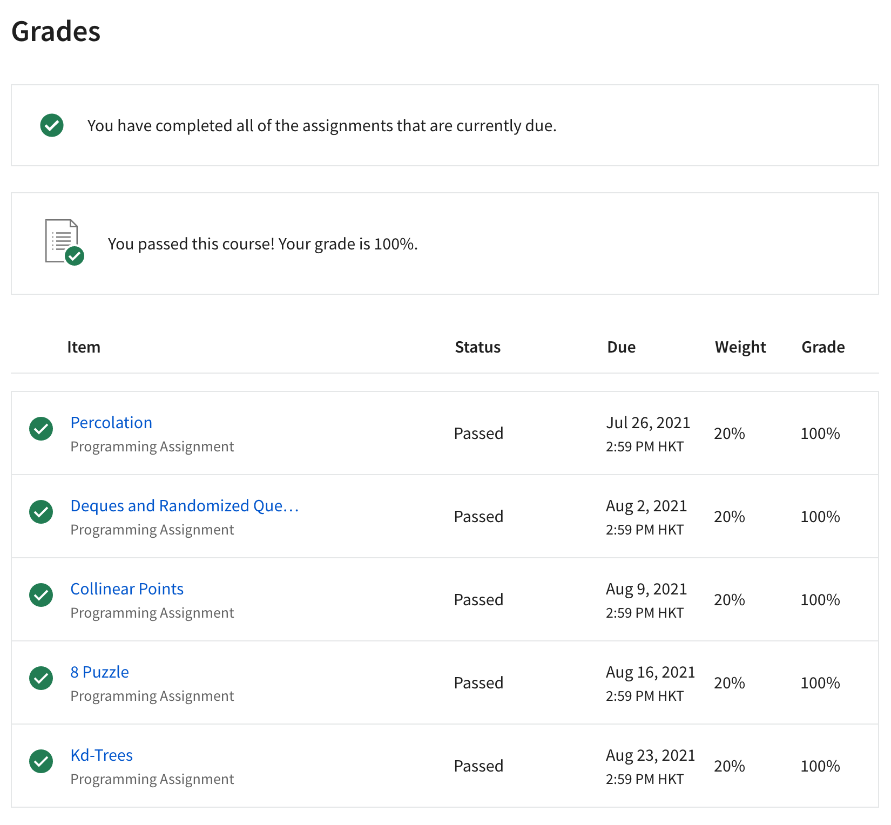
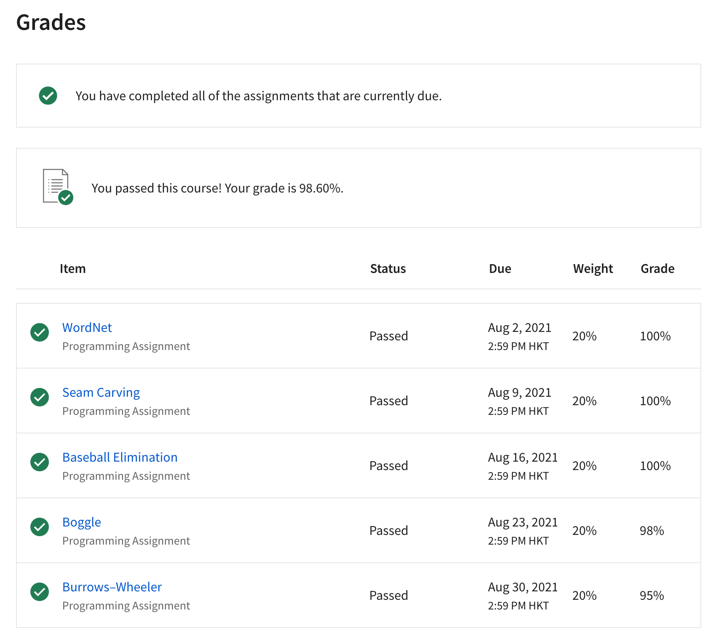

# Coursera Algorithms I & II Solutions Archive

This repository is an archive of my solutions for *Algorithms I & II* on Coursera.

Solutions are written in Aug 2021, the time when I only have little knowledge about Java. Hence despite the correctness of Online Judgement, the codes are still prone to be problematic or ill-formed.

## 1. Sources

Algorithms I: [Source Link](https://www.coursera.org/learn/algorithms-part1/)
Algorithms I: [Source Link](https://www.coursera.org/learn/algorithms-part2/)

## 2. Archives

- [Lecture Slides](./lecture_slides)
- [Assignment Specifications](./specifications)

## 3. Record

